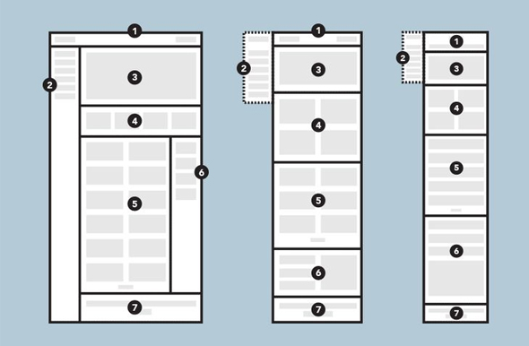

# Responsive Code-Along

Practice building a responsive web page using semantic layout and incremental development.

### Index

* [Learning Objectives](#learning-objectives)
* [Instructions](#instructions)
* [Mock-Ups](#mock-ups)
* [Study Links](#study-links)

---

## Learning Objectives

* Develop a responsive design from a series of mock-ups
* Plan steps ahead of time (accounting for each device!)
* Start from an empty project
* Develop each step on one branch
* Use semantic HTML5 elements
* Apply media queries & CSS units for responsive design
* Write clean and readable code
* Deploy a polished repository

[TOP](#responsive-code-along)

---

## Instructions

1. Fork this repository, turn on GitHub pages, and clone
1. Study the 3 [mock-ups](#mock-ups)
1. Plan your user stories in [./development-strategy.md](./development-strategy.md)
1. Develop one story at a time
    1. Create a new branch before beginning each story
    1. Code the story _entirely_. Make sure the code is pretty and everything works
    1. Push the new branch to GitHub
    1. Merge the completed story into `master`
    1. Push `master` to GitHub
    1. Repeat!
1. have a nice day!

[TOP](#responsive-code-along)

---

## Mock-Ups

<!-- https://line25.com/wp-content/uploads/2015/12/Annotating-Wireframes.jpg -->

[TOP](#responsive-code-along)

---

## Study Links

### Branching & Incremental Development

* [Demo project to study](https://github.com/hackyourfuturebelgium/built-with-branches)

### Semantic Layout

* [Why, How and When? (css-tricks)](https://css-tricks.com/why-how-and-when-to-use-semantic-html-and-aria/)
* [What is "semantics"? (MDN)](https://developer.mozilla.org/en-US/docs/Glossary/semantics)
* [Using Sections and Outlines (MDN)](https://developer.mozilla.org/en-US/docs/Web/Guide/HTML/Using_HTML_sections_and_outlines)
* [Semantic Elements (FreeCodeCamp)](https://guide.freecodecamp.org/html/html5-semantic-elements/)
* [Semantic Elements (w3schools)](https://www.w3schools.com/html/html5_semantic_elements.asp)
* [HTML5 Semantic Elements vs. CSS](https://stackoverflow.com/questions/16767617/semantic-html5-structure-versus-css-layout-needs)

### Responsive Web Design

* [What is it?](https://en.wikipedia.org/wiki/Responsive_web_design)
* [Using Media Queries](https://developer.mozilla.org/en-US/docs/Web/CSS/Media_Queries/Using_media_queries)
* [Simulating Devices](https://developers.google.com/web/tools/chrome-devtools/device-mode/)

### CSS & Styling

* [cascade & inheritance](https://developer.mozilla.org/en-US/docs/Learn/CSS/Building_blocks/Cascade_and_inheritance)
* [CSS Specificity](https://css-tricks.com/specifics-on-css-specificity/)
* [CSS Positioning](https://css-tricks.com/almanac/properties/p/position/)

### Inspecting the DOM

* [How to inspect an element](https://www.lifewire.com/get-inspect-element-tool-for-browser-756549)
* [Inspecting the DOM?](https://hackyourfuture.be/inspecting-the-dom)
* [Live DOM Viewer](https://software.hixie.ch/utilities/js/live-dom-viewer/?%3C!DOCTYPE%20html%3E%0A%3Chtml%3E%0A%0A%3Chead%3E%0A%20%20%3Cmeta%20charset%3D%27utf-8%27%3E%0A%20%20%3Cstyle%3E%0A%20%20%20%20.container%20%7B%0A%20%20%20%20%20%20display%3A%20flex%3B%0A%20%20%20%20%20%20flex-direction%3A%20column%3B%0A%20%20%20%20%7D%0A%0A%20%20%20%20.above%20%7B%0A%20%20%20%20%20%20order%3A%201%3B%0A%20%20%20%20%7D%0A%0A%20%20%20%20.below%20%7B%0A%20%20%20%20%20%20order%3A%202%3B%0A%20%20%20%20%7D%0A%20%20%3C%2Fstyle%3E%0A%3C%2Fhead%3E%0A%0A%3Cbody%3E%0A%20%20%3Cdiv%20class%3D%22container%22%3E%0A%20%20%20%20%3Cp%20id%3D%22p-1%22%20class%3D%22below%22%3E%0A%20%20%20%20%20%20first%20p%0A%20%20%20%20%3C%2Fp%3E%0A%20%20%20%20%3Cp%20id%3D%22p-2%22%20class%3D%22above%22%3E%0A%20%20%20%20%20%20second%20p%0A%20%20%20%20%3C%2Fp%3E%0A%20%20%3C%2Fdiv%3E%0A%3C%2Fbody%3E%0A%0A%3C%2Fhtml%3E%0A)
* [DOM Tutor](https://janke-learning.org/dom-tutor)
* [Modify the DOM](https://zapier.com/blog/inspect-element-tutorial/) - does the source change?

---
---

### 
